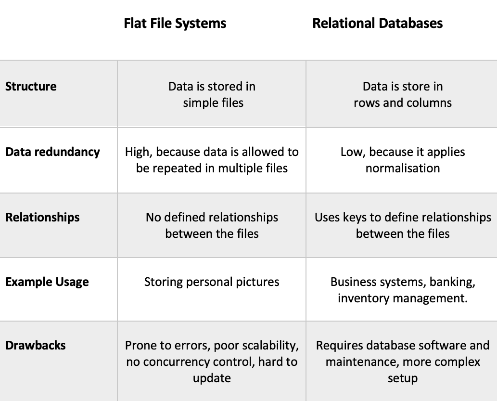
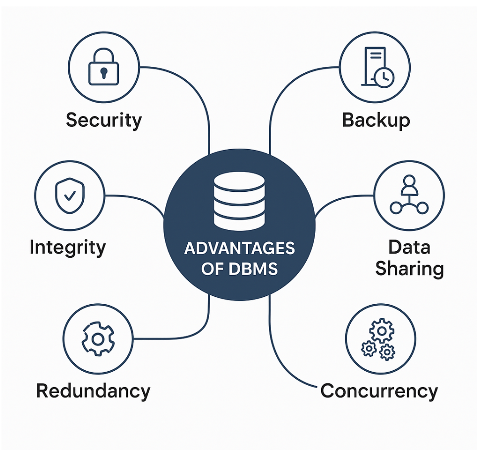

Intro to Databases

1. Flat File Systems vs. Relational Databases

2. DBMS Advantages – Mind Map

3. Roles in a Database System

1. System Analyst:  Bridge between business needs and technical solutions.
2. Database Designer:  Architect of the database structure.
3. Database Developer: Implements and programs the database components.
4. Database Administrator (DBA):  Guardian and maintainer of the database 
system.
5.  Application Developer: Builds the front-end or back-end of the system 
that uses the database.
6. BI (Business Intelligence) Developer: Turns raw data into insights.

